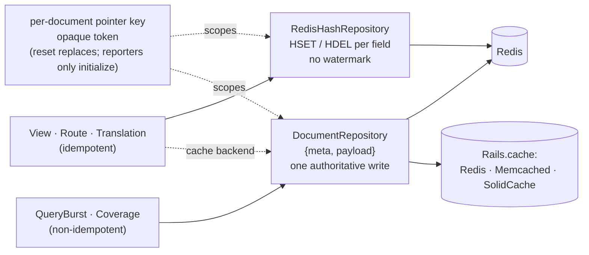

# Implementation Plan: Generic ActiveSupport::Cache Adapter

Tracking issue: [#533 Build generic Active Support Cache adapter](https://github.com/danmayer/coverband/issues/533)

Status: **shipped in #652**, for the **7.0.0** major release, with breaking
storage-format changes.

This began as a plan and is now a description of what was built, kept because
most of it is reasoning that the code cannot carry: what was rejected and why,
which guarantees are real and which are best-effort, and what the first
implementation got wrong. Where a design decision changed under testing, the
change is recorded rather than the original silently edited away.

Two rounds of correction are folded in. Review of the first implementation found
that a dropped delta must be stepped over rather than stalled on, an
initialization race has to be proven rather than assumed, tombstones need
timestamps, and an observed delete has to move the enqueue epoch. Seven rounds
of testing against a real Rails app on Redis, Memcached, and Solid Cache then
found nine more, every one of them in the seams around the protocol rather than
in the merge algorithm: who owns work that could not be stored, what a cap
actually bounds, and what silence means. Those are marked **[found in testing]**
where they appear.

## Goal

Ship one `Coverband::Adapters::ActiveSupportCacheStore` that works against any
`ActiveSupport::Cache::Store`, so Coverband supports Redis, Memcached, files, and (via
SolidCache) Postgres/MySQL/SQLite through a single adapter instead of a growing set of
bespoke ones. The adapter must support the tracker features (views/routes/translations/query
bursts), not just coverage storage — today those are Redis-only because they reach through
the adapter to raw Redis commands.

Along the way, improve the read-modify-write merge conflict Coverband has always had on
`RedisStore` — without LUA, using a protocol that works on any backend.

### Non-goals

- **`HashRedisStore` coverage storage remains unchanged; its shared tracker persistence does
  change.** Its LUA scripts, per-file keys, and per-line timestamps are not replaced,
  generalized, or deprecated, and it remains the recommendation for large multi-process
  fleets. But tracker storage is being rewritten for *all* adapters, so `HashRedisStore`
  inherits the new tracker repository — including the query-burst conflict repair shown in
  the guarantees table. Revision 7's blanket "stays as-is" overstated this.
- Changing the default store. `RedisStore` remains the default.
- Deprecating `FileStore`. Its per-process-file + `merge_mode` workflow
  (`utils/tasks.rb:113`) is materially different from `ActiveSupport::Cache::FileStore`.
- Removing `redis` as a runtime dependency — see [Follow-ups](#follow-ups).

## Decisions

| # | Decision |
| --- | --- |
| 1 | **Back-port the merge protocol to `RedisStore`** in this release. |
| 2 | **`@pending` retention:** a queue of 5 for trackers and 3 for coverage, plus a hard byte cap **and an absolute wall-clock age cap**; drop with a logged warning and a recorded data-loss event. |
| 3 | **No legacy data migration.** New storage formats start fresh. **Breaking change**, major version bump, called out in `changes.md`. |
| 4 | **Default reporting cycle moves to 600s** for the new adapter. |
| 5 | Name stays `ActiveSupportCacheStore`; only `MemcachedStore` is deprecated; `FileStore` users wanting trackers are pointed at the new adapter. |

### Breaking changes for 7.0.0

- **Coverage data does not survive the upgrade.** Documents gain a `{meta, payload}` shape
  and generation-scoped keys, so a new `STORAGE_FORMAT_VERSION`. Old keys are left behind.
- **Tracker data does not survive the upgrade**, same reason. Query-burst data additionally
  changes from a Redis hash to a single JSON document (see
  [storage layout](#storage-layout-follows-the-merge-type)).
- **Legacy `MemcachedStore` data is not migrated.** The class survives as a deprecated
  subclass with its `memcached_namespace` option and reader intact.
- **`background_reporting_sleep_seconds` default changes to 600** for the new adapter
  (`HashRedisStore` keeps 300, others keep 60).

## Current state audit

### 1. `MemcachedStore` is already an ActiveSupport::Cache adapter in disguise

`lib/coverband/adapters/memcached_store.rb` only calls `read` / `write` / `delete` on the
object it is handed, and its test passes an `ActiveSupport::Cache::MemCacheStore`
(`test/coverband/adapters/memecached_store_test.rb:12`).

### 2. Complete inventory of `raw_store` consumers

`raw_store` is reached only from the three tracker classes. Nothing else in `lib/` uses it.

| Location | Method | Redis commands |
| --- | --- | --- |
| `collectors/abstract_tracker.rb:56` | `used_keys` | `hgetall` |
| `collectors/abstract_tracker.rb:79` | `tracking_since` | `get` |
| `collectors/abstract_tracker.rb:89` | `reset_recordings` | `del` ×2 |
| `collectors/abstract_tracker.rb:97` | `clear_key!` | `hdel` |
| `collectors/abstract_tracker.rb:105` | `save_report` | `set`, `hset` (multi-field) |
| `collectors/abstract_tracker.rb:159` | `tracker_time_key_exists?` | `exists?` / `exists` |
| `collectors/view_tracker.rb:71` | `used_keys` | `hgetall` |
| `collectors/view_tracker.rb:105` | `clear_key!` | `hdel` |
| `collectors/query_burst_tracker.rb:56` | `used_keys` | `hgetall` |
| `collectors/query_burst_tracker.rb:66` | `used_key_stats` | `hgetall` |
| `collectors/query_burst_tracker.rb:95` | `save_report` | `set`, `hgetall`, `hset` (multi-field) |

Every non-Redis adapter raises `NotImplementedError` from `raw_store` (`file_store.rb:72`,
`memcached_store.rb:58`, `null_store.rb:33`, `stdout_store.rb:32`) and
`AbstractTracker#redis_store` (`abstract_tracker.rb:150`) rescues that into `nil`, so file and
memcached users get four trackers silently doing nothing and empty web UI tabs.

### 3. Three write patterns — and this is what drives storage layout

| Pattern | Where | Merge | Idempotent? |
| --- | --- | --- | --- |
| Additive line counts | coverage blob (`base.rb:105` → `array_add`) | sum per line | **No** |
| Presence + timestamp | view/route/translation trackers | `max(timestamp)` | **Yes** |
| Additive counters | `QueryBurstTracker` | sum / max | **No** |

### 4. The conflict is pre-existing, on Redis, in two places

- **Coverage.** `RedisStore#save_report` (`redis_store.rb:60-67`): *"this could lead to slight
  race on redis where multiple processes pull the old coverage and add to it then push."*
- **Query bursts.** `QueryBurstTracker#save_report` (`query_burst_tracker.rb:101-107`) does
  `hgetall` → merge → `hset` **on Redis today**; cumulative totals can silently lose data.

### 5. Other adapter couplings that are not `raw_store`

| Location | Coupling | Plan |
| --- | --- | --- |
| `reporters/json_report.rb:112` | `store.cached_file_count`, defined only on `RedisStore` and `HashRedisStore` | Existing latent `NoMethodError` for `FileStore`/`MemcachedStore`. Add a `Base` default. |
| `reporters/html_report.rb:19` | Pagination gated on `is_a?(HashRedisStore)` | Convert to a capability predicate. |
| `utils/source_file.rb:35` | `timedata` only from `HashRedisStore` | Stays Redis-only; already null-safe. |
| `configuration.rb:205` | `background_reporting_sleep_seconds` | New adapter defaults to **600**. |
| `adapters/base.rb:40` | `size_in_mib` does `if size`, but `MemcachedStore#size` returns `"N/A"` | Truthy string → reports `"0.00"`. Fix. |
| `utils/tasks.rb:113` | `merge_mode` on `FileStore` | Unaffected. |
| `lib/coverband.rb:5`, gemspec | Hard `require "redis"` + runtime dep | See [Follow-ups](#follow-ups). |

### 6. CI has no memcached

Only a Redis service exists, and the memcached test is gated behind
`ENV["COVERBAND_MEMCACHED"]` — so **it has never run in CI**.

## The concurrency contract

### Rejected: rewrite the full key set every cycle

Revision 1's proposal, **rejected** on cost and correctness. Estimated documents for a large
app: translations ~1.1 MB (20k keys, **over memcached's 1 MB cap**), views ~480 KB, routes
~270 KB, query bursts ~260 KB — ~2 MB written plus an equal read per process per cycle,
scaling with `processes × app size` and never quieting. The delta path writes *nothing* in
steady state. It also resurrects deleted keys from stale in-memory sets.

### Document identity

A **document** is the unit of storage, reset, and conflict, one per independently resettable
thing: `coverage.runtime`, `coverage.eager_loading`, `tracker.ViewTracker`,
`tracker.RouteTracker`, `tracker.TranslationTracker`, `tracker.QueryBurstTracker`. The set is
static and enumerable from `Coverband::TYPES` plus `Coverband.configuration.trackers`.

Each document has **its own generation pointer**; resetting the view tracker must not
invalidate coverage.

### The co-reversion invariant

This is the rule revision 6 violated, stated so it cannot be violated again:

> For any document whose merge is **non-idempotent**, metadata and payload must be
> co-written **and co-reverted**. A layout in which a stale write can revert the metadata
> while leaving payload contributions intact is forbidden.

The proposed Redis tracker hash broke the second half. A single multi-field `HSET` co-writes,
but **unchanged hash fields survive a stale write while the serialized metadata field does
not**:

1. A and B read the hash.
2. A writes query key X plus metadata `{A: 1}`.
3. B writes query key Y plus its stale metadata `{B: 1}`.
4. X and Y are both present, but A's watermark is gone.
5. A sees no watermark and re-applies X — **double counted**.

### Storage layout follows the merge type

The fix is not to blob everything; it is to match layout to merge semantics.

| Document | Merge | Redis layout | Cache layout |
| --- | --- | --- | --- |
| `coverage.*` | additive, **non-idempotent** | single JSON `SET`, `{meta, payload}` | single write, `{meta, payload}` |
| `tracker.QueryBurstTracker` | additive, **non-idempotent** | **single JSON `SET`, `{meta, payload}`** (changed from a hash) | single write, `{meta, payload}` |
| `tracker.View/Route/Translation` | `max(timestamp)`, **idempotent** | **native hash: per-field `HSET` / `HDEL`, no watermark** | single write, `{meta, payload}` + watermark |

The governing rule, stated so the two concerns are not conflated:

> **Every whole-document read-modify-write layout uses applied sequences for conflict
> detection. Non-idempotent layouts additionally require the watermark for retry safety.**

Revision 7 collapsed those into one and wrongly concluded that idempotent cache documents
could skip the watermark. They cannot. Cache presence merging *is* idempotent, but the
watermark is still what tells a writer that a stale whole-document write erased its key —
and without that signal, the losing process's permanent `@logged_keys` dedupe guarantees the
key is never re-enqueued and the loss is permanent.

Why the layout split is still correct:

- **Redis presence trackers** use native per-field `HSET`, so there is no whole-document
  read-modify-write and no conflict to detect: a field written by one process is never
  reverted by another's write. That is strictly stronger than any blob protocol. It preserves
  the **hash field/value representation and per-field operation semantics** — not the complete
  wire format, since generation-scoped keys change the physical key layout regardless.
- **Cache presence trackers** are whole-document, so they carry applied sequences for
  conflict detection — used for repair, not for retry safety.
- **Query bursts** move from a hash to one authoritative JSON document. A format change, but
  the feature is new in 6.2.2 (#644) and it is the one place the co-reversion counterexample
  bites.

#### Redis `clear_key!` is best-effort, not durable

Revision 7 claimed Redis presence trackers need no tombstones because a later re-add is a
genuine re-observation. That is wrong:

1. Process B observes key K and queues `HSET K`.
2. Process A executes `HDEL K`.
3. B flushes its **pre-delete** queued write.
4. K is resurrected with no post-delete observation behind it.

`HDEL` is durable against nothing that is already in flight. Without LUA, tombstones, or a
whole-document protocol, **Redis single-key deletion is best-effort** — stated that way in the
guarantees table rather than dressed up. Making it strong would mean moving presence trackers
to the whole-document layout too, trading away their per-field atomicity for a rarely used
admin action; that trade is not worth it, but the limitation must be honest. Cache presence
trackers get version-based tombstones, which close the same window for whole-document layouts.

### Mechanism 1 — idempotent merge via per-writer applied-sequences

Applies to **every whole-document layout** — all cache documents, plus Redis coverage and
Redis query bursts. Idempotent documents use it for conflict *detection* and repair;
non-idempotent documents additionally depend on it for retry safety. Only Redis presence
trackers, which write per-field, sit outside it.

```ruby
{
  "meta" => {
    "applied" => {
      "9f3c1a…" => { "seq" => 512, "last_seen" => 1750003600, "host" => "web-01", "pid" => 4123 }
    },
    "started_at"      => 1750000000,
    "tombstone_epoch" => 3,
    "tombstones"      => { "app/views/foo.erb" => 3 }
  },
  "payload" => { ... }
}
```

`host`/`pid` are **diagnostic only**.

#### The write algorithm, formally

A writer holds `@pending`, an ordered list of **immutable** deltas with strictly increasing
sequences. Each cycle:

1. Read this document's generation pointer. Token differs → see
   [token-change handling](#token-change-handling).
2. Read the document for that generation.
3. `w = meta.applied[writer_id].seq` (0 if absent — see
   [missing watermark](#missing-watermark-recovery)). **Discard from `@pending` every delta
   with `seq <= w`.**
4. Take the **contiguous prefix** of the remainder, stopping at the first gap.
5. Merge that prefix in sequence order as one cumulative application, and write the document
   **once**, setting `applied[writer_id].seq = w+n`, `last_seen = now`.
6. **Keep the prefix in `@pending`** until a later cycle's step 3 proves it landed.

Invariant: **`applied[writer_id].seq = s` means every sequence `1..s` from that writer is
represented in this payload.** Step 4 refuses to skip gaps; step 5 records only what it
applied.

#### The cap is a queue depth, not a cycle count

The cycle that recovers carries its own delta, so it takes a slot alongside the
retained ones: **a cap of N absorbs an outage of N - 1 cycles**. Coverage is
capped at 3 to deliver the two cycles above, and trackers at 5 for four.

Trackers only lean on this when storage has taken responsibility for the work.
While a report is unstored (`:failed`, `:unavailable`, or a raise) the tracker
keeps its own key set, which is unbounded and re-supplied every cycle, so an
outage of any length is lossless for them. The queue bounds coverage, which has
no second copy anywhere: `Delta` has already advanced its baseline by the time
a report is handed over.

Which is also why only coverage retains work on failure. If both the tracker and
the session held the same delta they would each replay it, and for the additive
trackers that double counts.

Loss is not the only thing worth reporting, and for one shape it is not even the
first thing to happen. A document that can never be written -- past memcached's
value limit, say -- drops nothing, because a quiet tracker enqueues nothing new
for the caps to drop; the queue sits at one delta and only the absolute age cap
eventually converts the stall into a recorded loss, an hour later by default.
Until then an empty tracker tab is indistinguishable from an app that used
nothing, which is the same "reads as unused" hazard, reached by a stuck document
rather than a dropped delta.

So the session reports held work (`unwritten`) separately from lost work
(`data_loss`). It is process-local, unlike a recorded loss, because the failure
is precisely that nothing can be stored -- there is nowhere durable to put the
marker. That is acceptable here: any process rendering the report is also a
reporting process, and a document that is unwritable is unwritable for all of
them.

Idempotence buys one more thing at the far end of an outage. The queue is
bounded, so loss past the cap is linear in outage length — but a presence
tracker still holds its keys locally, and re-supplying them costs nothing when
the merge takes the later timestamp. Those three trackers queue what they know
again whenever storage reports `pending_dropped`, so the loss is recovered
rather than permanent. `QueryBurstTracker` cannot: re-supplying a summed counter
is exactly the double count `:retained` exists to prevent, so its loss past the
cap is irreducible, and is reported instead.

The same reasoning decides what `record` may return, and whether it may raise at
all. "Refused" is two different situations, and only the session knows which:
work rejected *before* it was enqueued is the caller's again (`:failed`,
`:unavailable`), while a write refused or errored *after* the enqueue is in the
queue and still ours (`:retained`). A raise is itself a signal of the first kind,
since a caller that sees an exception keeps its copy — so once the delta has been
taken, the failure is logged rather than raised.

#### Deltas are immutable after enqueue

Expanded (`expand_report`, stamping `first_updated_at` / `last_updated_at` / `file_hash`) and
serialized **once at enqueue**, then frozen; retries re-send identical bytes. Load-bearing:
re-expanding would hand an old delta a fresh timestamp, letting it bypass a tombstone
recorded in between.

**The freeze has to reach the line arrays**, and a shallow `Hash#freeze` does not. Two
things alias into a delta's payload: `expand_report` stores the caller's own line array
under `data` rather than a copy, and `array_add` sums into the array it is handed unless
that array is frozen. So an unfrozen delta gets overwritten with the merged document
total the first time it is applied — and a delta only survives its first apply when it
needs repairing, which is exactly when it gets applied again. Each repair then adds the
whole document to itself. Under contention this compounds per cycle: a benchmark of 4
processes × 25 cycles expecting 100 hits per line read 2.5 million.

The measurement to keep: with the arrays copied and frozen, the same benchmark converges
on exactly 100 at moderate contention, and undercounts *with a `pending_dropped` data-loss
marker* when contention exceeds the retention cap. Silent inflation is the failure this
section exists to prevent; bounded, reported loss is the designed behavior.

#### Writer identity

`digest(hostname + pid)` is unsafe — PIDs are reused, and forks would share identity.

- `writer_id` is a **process-lifetime random nonce** (`SecureRandom.hex`). `host`/`pid` are
  diagnostic only.
- The writer records its `Process.pid` and checks it every report. **On PID change (fork) the
  child regenerates `writer_id`, resets `seq`, and discards inherited `@pending`** —
  re-applying under a new identity what the parent may already have applied would double
  count.

#### Missing-watermark recovery

A live writer holding pending deltas that finds its `applied` entry **absent** cannot tell
"pruned but applied" from "never applied". Rule: a writer that has **previously observed a
non-zero watermark for itself** and finds it absent **rotates to a fresh `writer_id`, drops
its ambiguous pending deltas, and records data loss**. A genuinely fresh writer (no prior
watermark, pending starting at seq 1) is unambiguous and proceeds.

#### Gap taxonomy

| Cause | Trigger | Response |
| --- | --- | --- |
| Retention cap | queue of 5 (trackers) / 3 (coverage) / byte cap | Drop, record loss, advance past gap once |
| Absolute age | Wall-clock cap, independent of cycle count | Same |
| Identity rotation | Missing-watermark recovery | New identity, pending dropped, loss recorded |

**"Advance past the gap" is load-bearing, and the first implementation missed
it.** `contiguous_prefix` looks for `watermark + 1`; if the cap dropped exactly
that sequence, the prefix is empty on this flush *and every flush after it*, so
the document silently stops being written forever. Surviving deltas are
therefore renumbered contiguously above the watermark whenever a drop punches a
hole — carrying their payloads, enqueue times, and observed tombstone epochs
across untouched, since a delta stays immutable once enqueued. **The sequence
counter has to come back to the watermark even when nothing survives the drop**,
or the next enqueue starts above the watermark and wedges the writer just as
thoroughly.

The absolute age cap exists because cycle-based bounds say nothing in wall-clock terms — a
suspended or descheduled process can hold pending state far longer than any cycle count.

#### Pruning horizons

```
absolute pending age cap  <  applied pruning horizon
absolute pending age cap  <  tombstone pruning horizon
```

At the 600s default: age cap 1 hour, horizons 3+ hours. A delta is always dropped by the age
cap before its guard or its filtering tombstone can be pruned from under it; anything that
outlives that is caught by missing-watermark recovery.

#### Deletion: version-based tombstones

For documents written as a whole (all cache documents; Redis coverage and query bursts):

- `delete_entry(key)` / `clear_file!(file)` enqueue a **delete delta** through the same
  algorithm.
- Applying it increments `tombstone_epoch`, records `tombstones[key] = epoch`, and removes
  the key — all in the one authoritative write.
- **No wall-clock comparison.** Every pending delta is stamped at enqueue with the
  `tombstone_epoch` its writer had observed. An incoming entry for a tombstoned key is
  accepted only if the delta's observed epoch is `>=` the tombstone's. A stale writer that
  never saw the delete carries a lower epoch and is dropped rather than resurrecting the key.
- **Tombstones still need a recorded time, for pruning only.** Pruning them by a count of
  later deletes — as the first implementation did — lets a burst of clears evict a
  seconds-old tombstone while a delta stamped before it is still pending, which is exactly
  the resurrection the epoch protects against. The pruning horizon is time based and longer
  than the pending age cap, so a delta always expires before its filter does.
- **Observing a delete must move the enqueue epoch.** A writer that cached epoch 0 and then
  read a document showing epoch 3 has to stamp its *next* delta with 3. Leaving the cached
  value stale makes that writer's own genuine later observations look pre-delete, so they are
  filtered out and the key can never be recorded again.

**Tombstone observation is scoped to one generation.** The epoch a process has
seen, and any queued notifications, must be cleared whenever the token changes:
epochs restart at zero in a new generation, so a remembered epoch from the
retired one masks the new generation's first deletes and local dedupe is never
invalidated for those keys.

**Observing a tombstone must invalidate local dedupe.** Presence trackers keep keys forever
in `@logged_keys`, so without this a legitimate future use of a cleared key would never be
enqueued again. On reading a tombstone for key K with epoch > the epoch last observed, a
writer **removes K from local dedupe state and discards its own pending entries for K stamped
below that epoch**. The next genuine observation of K is then recorded normally, under the new
epoch.

Redis presence trackers use `HDEL` and have no tombstone mechanism available without changing
their layout, so they are **best-effort** per the counterexample above.

**Honest limit:** even on whole-document layouts, a per-key delete converges only while the
initiating process is alive with the delta pending. If it exits first, the delete may be lost.
The web UI reports clears as *submitted*, applied within a reporting cycle. `reset` / `clear!`
do not have this limitation.

### Mechanism 2 — generation pointer (strong reset)

**Per-document pointer holding an opaque random token.**

- Pointer key: `coverband.<format_version>.<namespace>.<document_identity>.pointer`
- Data key: `coverband.<format_version>.<namespace>.<document_identity>.g<token>`
- Tokens are never ordered — compared for **equality** only.

The invariant, precisely worded: **reporters never *replace an existing* pointer.** They may
initialize an absent one; only reset replaces one that exists.

| Event | Behavior |
| --- | --- |
| **Initialization** | Pointer absent → write a fresh token with `unless_exist: true`. The question is **not whether the method accepts the option** — ActiveSupport 8.1's `MemoryStore` and `FileStore` both accept it — but whether creation is **atomic across the processes that matter**. Redis and Memcached give a genuine atomic create; `FileStore` and `MemoryStore` do not (and `MemoryStore` is per-process anyway). The contract test asserts atomic-create semantics per backend and routes non-atomic backends through init-race carry-forward, below. |
| **Reset** | Write a fresh token **without reading first**. Concurrent resets collapse harmlessly — each is a valid reset. |
| **Pointer evicted** | Re-initialize with a fresh token, and record `:orphaned_generation`. `resolve` therefore has to report *that the pointer was absent*, not just hand back a token: without that evidence the caller cannot tell first-ever initialization from the eviction of a pointer it was already using. **This does not imply the document was evicted**; the cache may drop the small pointer and keep the large document. The retained document is thereby orphaned, so this path **records a data-loss event** classifying the old generation as orphaned rather than assuming it was already gone. |
| **Pointer write fails / returns `false`** | **Reset reports failure** to the caller and the UI. "Strong reset" means *strong once the pointer write succeeds* — never a silent partial reset. Local state must be dropped only by the generation-change callback that fires *after* the write lands, or a failed reset destroys unsaved work while the old generation is still authoritative. |

#### Token-change handling

Revision 6 said "token differs → drop all local state", which silently discarded real
first-cycle data when a writer lost an initialization race. The rule is now split:

- **Reset-driven change** (the writer had previously observed a *pre-existing* pointer): drop
  local state. An operator deliberately cleared; that is the intent.
- **Init-race change** (the writer itself initialized the pointer and has never seen another):
  **carry unconfirmed pending deltas forward into the new generation.** This is safe because a
  pointer is never reverted — the orphaned generation can never become authoritative again, so
  the carried deltas cannot already be counted in the surviving document.
- If carry-forward is impossible (deltas already dropped by a cap), record data loss.

**Distinguishing the two needs evidence, not a flag.** The first implementation
tracked "did I create this pointer?" and treated any later token change as a
race, so an operator reset was misread and pre-reset work was applied to the
fresh generation. Two facts settle it instead: a reset **names the token it
retired** in the pointer's cleanup queue, and a backend with **atomic create
cannot produce an initialization race at all**. Anything not provably a race is
treated as a reset, because carrying work across a deliberate clear is the worse
mistake.

#### Cleanup: a bounded queue, not one slot

A single `retire` slot leaked in three ways: a second reset overwrote the first instruction
before its sweep ran; reporters could never clear a completed instruction without writing the
pointer, so deletes repeated forever; and `clear!` cannot enumerate arbitrary random-token
keys on a cache with no key enumeration.

**The queue is best-effort, and this is a real limitation, not a wording softener.** Appending
requires reading the old pointer, which conflicts with reset's "write without reading first".
Two concurrent resets can read the same pointer, build queues independently, and overwrite one
another, losing a cleanup instruction. Without CAS that is unfixable, so it is accepted:
**strong reset correctness is unaffected — only cleanup is** — and a dropped instruction means
one more orphaned generation, which the leakage policy below already covers.

- The pointer value carries a **bounded FIFO cleanup queue**, capped (8 entries), appended
  on a best-effort basis rather than replaced:

  ```ruby
  { "token" => "b21f…",
    "retire" => [ { "token" => "9ac0…", "after" => 1750004200 },
                  { "token" => "31de…", "after" => 1750004900 } ] }
  ```

- Any ordinary reporter observing `after < now < after + sweep_window` (24h) issues the
  delete. Idempotent, unowned, and **bounded** — outside the window reporters stop, so no
  endless repetition, and no reporter ever writes a pointer.
- The **next reset** prunes entries older than the window when it writes the pointer.
- **`clear!` cannot enumerate orphans on a cache backend.** Revision 6's claim that it removes
  all generations is withdrawn. `clear!` advances every known document pointer and deletes the
  current plus queued generations. Residual orphans arise from init races, stragglers,
  queue overflow, and dropped queue entries.
- **This leakage is rate-bounded, not total-bounded.** Each individual path produces orphans
  rarely, but nothing reclaims them, so over many resets and restarts they can accumulate
  **without an upper bound in the absence of key enumeration or cache-wide expiration**. On
  Redis a `SCAN`-based `rake coverband:clear_orphans` reclaims them by key pattern — checking
  each candidate against its pointer immediately before deleting, and skipping recently written
  generations, since a snapshot taken earlier would let a concurrent reset make the newly
  authoritative document look like an orphan. On cache
  backends the practical reclaimers are the backend's own expiry (which is why SolidCache's
  `max_age` cuts both ways) or a full `Rails.cache.clear`. Documented as a known operational
  characteristic rather than described as bounded.

### Mechanism 3 — eviction detection

A writer holding a token that finds the pointer or document absent logs a warning, records
`data_loss_detected_at`, clears local dedupe — via the same generation-change callback a reset
uses, which a first implementation neglected to fire, leaving trackers holding `@logged_keys`
and never re-reporting anything — so its **locally reconstructible state** is
re-reported **once**, and exposes it for a web UI banner: *"tracker data was lost at
&lt;time&gt; — results before that point are unavailable."*

"Locally reconstructible" is the precise claim: presence trackers can re-report every key the
process has seen, and live coverage can be re-derived, but **historical query-burst aggregates
cannot** — the counters that were already folded into the destroyed document are gone. The
banner must not imply a full recovery.

**Limitation:** detection needs a surviving process that remembers a token. If eviction
coincides with a full restart — deploy, rolling restart, crash loop — absence is
indistinguishable from first use and the loss goes unreported.

### Resulting guarantees, stated precisely

**Conflicting writes are retried idempotently and normally converge while the originating
writer remains alive and the delta remains pending.**

| Property | `HashRedisStore` | `RedisStore` (7.0) | Cache adapter |
| --- | --- | --- | --- |
| Coverage conflict, quiescent | Cannot occur (LUA, per-file keys) | Repaired next cycle | Repaired next cycle |
| Coverage conflict, sustained | Cannot occur | Bounded by the queue / byte cap / age cap, then dropped + reported | Same |
| Presence trackers | Atomic per field | **Atomic per field** (native `HSET`, unchanged) | Conflict detected via applied sequences and repaired next cycle; **no bound** — dropped keys are re-supplied from the tracker's own set |
| Query-burst counters | Repaired next cycle | Repaired next cycle (was silently lossy; now one JSON document) | Repaired next cycle |
| Process death with pending deltas | No pending state | Loses that writer's unconfirmed cycle | Same |
| Long suspension | n/a | Pending dropped by age cap or identity rotation; loss recorded | Same |
| `reset` / `clear!` | Durable | **Strong once the pointer write succeeds**, per document | Same |
| `clear_key!` | Durable | **Best-effort** — `HDEL` cannot stop an in-flight pre-delete `HSET` | Converges while initiator lives; **best-effort** otherwise |
| `clear_file!` | Durable | Converges while initiator lives; best-effort otherwise | Same |
| Cleanup of retired generations | n/a | Best-effort — concurrent resets can drop a queue entry | Same |
| Whole-store eviction | Detected unless every process restarted | Same caveat | Same caveat |
| Orphaned generations | n/a | Cleanable via `SCAN` task | **Low-rate but potentially unbounded** without enumeration or cache-wide expiry |

`MemoryStore` is per-process and dev/test only in every row.

**[found in testing] What an outage actually costs**, once the caps are queue depths and the
idempotent trackers self-heal:

| | Tolerates | Then |
| --- | --- | --- |
| Coverage | 2 missed cycles | drops the oldest, records `pending_dropped` |
| Presence trackers | any outage, while the process lives | nothing lost; a restart mid-outage loses what only that process knew |
| Query bursts | 4 missed cycles | drops the oldest, records `pending_dropped` — irreducible, since re-supplying a summed counter double counts |

Anything that cannot be stored at all reports `unwritten` immediately rather than looking like
absence.

**I/O cost.** No extra *write*. Confirmation requires a read in a cycle that would otherwise be
silent, plus **one pointer read per document per cycle** — up to six for a process running
coverage plus four trackers, batched via `read_multi`/`MGET` into a single round trip at the
start of each reporting cycle.

A batched pointer is only good for the cycle that fetched it, and expires. A session that does
not report in that cycle would otherwise hold it indefinitely, and a reset in the meantime
would send its eventual write into a retired generation where nothing can read it.

## Design

### Capability predicates on `Adapters::Base`

```ruby
def tracker_storage           = nil            # repository, or nil when unsupported
def supports_trackers?        = !tracker_storage.nil?
def supports_paged_reports?   = false          # HashRedisStore only
def persistent_coverage?      = false          # eligible for the core coverage contract
def file_count                = coverage(Coverband::RUNTIME_TYPE).keys.length
def cached_file_count         = @cached_file_count ||= file_count
```

`file_count` needs a `Base` default too, not just `cached_file_count`: `FileStore` defines
neither today, so a core contract exercising `file_count` would fail against it. Both defaults
land in Phase 0.

`persistent_coverage?` is **true** for `RedisStore`, `HashRedisStore`,
`ActiveSupportCacheStore`, `MemcachedStore`, and `FileStore`; **false** for `NullStore`,
`StdoutStore`, and `WebServiceStore`, none of which have meaningful round-trip, `size`, or
`file_count` semantics. The core test contract is scoped to it.

`raw_store` is **kept unchanged** — public API — but nothing inside Coverband calls it.

### Tracker repository interface

```ruby
module Coverband::Adapters::TrackerStorage
  class Base
    def entries                        # -> Hash<String, String>, current generation
    def record(delta)                  # enqueue + flush pending prefix; states below
    def delete_entry(key)              # HDEL (Redis presence) or delete delta (whole-document)
    def reset                          # fresh pointer token; -> true | false (false = reset failed)
    def tracking_since                 # -> Time | nil
    def data_loss                      # -> nil | DataLoss(at:, kind:, detail:)
    def unwritten                      # -> nil | UnwrittenWork(deltas:, since:)
    def generation                     # -> String (opaque token)
    def pending_size                   # -> Integer
  end
end
```

`data_loss` kinds: `:eviction`, `:pending_dropped`, `:unconfirmed_dropped`,
`:identity_rotated`, `:orphaned_generation`, `:corrupt_document`.

`record`'s return values name protocol states, not outcomes. Revision 7's `:applied` was
ambiguous — after the initial write a delta is written but **not yet proven durable**, and
that distinction is the whole point of the watermark:

| Value | Meaning | Who holds the work |
| --- | --- | --- |
| `:written_unconfirmed` | Merged and written; still in `@pending` awaiting a later cycle's watermark check | storage |
| `:confirmed` | A prior write was proven durable by the watermark and dropped from `@pending` | storage |
| `:deferred` | Enqueued only — nothing flushed this call (no contiguous prefix, or not a report cycle) | storage |
| `:retained` | Taken, then refused or errored on the write; still ours to retry | storage |
| `:failed` | Refused **before** it was taken | the caller |
| `:unavailable` | The backend could not be reached at all | the caller |

**[found in testing]** The last column is the whole point, and `:retained` exists
because it was missing. `:failed` originally covered both a write refused before
the enqueue and one refused after it — but in the second case the delta is in the
queue, and a caller that kept its own copy replayed it. For `QueryBurstTracker`,
whose counters sum, that double counted on the documented memcached >1MB path.
A raise is itself a signal of caller ownership, for the same reason: a caller
that sees an exception keeps its copy, so once the delta is taken the failure is
logged rather than raised.

Two concrete families, chosen by merge type rather than by backend:
`TrackerStorage::RedisHashRepository` (idempotent presence trackers, native
per-field ops, no watermark) and `TrackerStorage::DocumentRepository` (everything
else, `{meta, payload}` in one authoritative write, over either target). One
`TrackerStorage::Factory` picks between them — `Factory.redis` and
`Factory.cache` differ only in how the target is built and whether native hashes
exist, so the layout decision lives in one place.



`AbstractTracker#redis_store` becomes a deprecated private alias for one release.

### What shipped, by file

The plan named behaviors, not files. For a reader starting from the code:

| File | Role |
| --- | --- |
| `storage/session.rb` | the merge protocol: enqueue, flush, watermarks, data loss, held work |
| `storage/writer.rb` | writer identity and the pending queue, including the caps |
| `storage/document.rb` | `{meta, payload}`, watermarks, tombstones, pruning |
| `storage/generation.rb` | the pointer, reset, retirement queue, sweeps |
| `storage/generation_lifecycle.rb` | pointer bookkeeping shared by the session and the Redis hash repository |
| `storage/target.rb`, `redis_target.rb` | the two backends behind one small interface |
| `storage/read_fallback.rb` | reads degrade rather than raise, shared by both repositories |
| `storage/io_guard.rb` | marks Coverband's own storage I/O so query bursts ignore it |
| `adapters/session_coverage.rb` | coverage on the protocol, shared by both coverage adapters |
| `adapters/tracker_storage/` | `Factory`, and the two repository layouts it picks between |

### Cache target contract

**The `ActiveSupport::Cache::Store` interface**, not a loose duck type. The adapter still does
not `require "active_support"`.

| Method | Used for |
| --- | --- |
| `read(name)` | fetch documents |
| `read_multi(*names)` | batch every pointer a reporting cycle needs into one round trip |
| `write(name, value, expires_in: nil)` | store documents and pointers; **return value honored** |
| `write(name, value, unless_exist: true)` | pointer initialization where supported |
| `delete(name)` | cleanup-queue sweeps |
| `exist?(name)` | initialization checks |

No CAS and no locking is required. `unless_exist` support must be **verified per backend**,
not assumed — a store that silently ignores the option degrades to last-write-wins, which the
init-race carry-forward path already covers, but the contract test must assert one path or the
other actually ran.

### SolidCache (database-backed) considerations

SolidCache is the most interesting target here — it is the reason this issue mentions
Postgres/MySQL/SQLite — and it is the one backend whose own behavior interacts with the
protocol rather than just hosting it.

#### Quiet documents expire — and this is broader than the pointer

Per the [Solid Cache README](https://github.com/rails/solid_cache): expiry is by **write
age**, **reads do not refresh an entry**, the default `max_age` is **two weeks**, and
`max_age: nil` is supported but recommended only alongside a size constraint
(`max_size`/`max_entries`).

Revision 7 claimed "every document is rewritten each cycle, so only the pointer is at risk."
That is wrong, and the correction matters more than the original point:

- **Coverband writes deltas, not heartbeats.** A presence tracker writes only when it observes
  a *new* key. In a stable application the view tracker stops seeing new views within days —
  after which its document receives no writes at all and ages out on the two-week clock. The
  same applies to a quiet query-burst document.
- The generation pointer is still the extreme case (written only on reset), but it is one of
  several rarely-written keys, not the exception.

The mitigations differ between the two, and the difference is a protocol property worth
stating:

1. **Documents can be safely kept alive; the pointer cannot.** A keep-alive is just an
   ordinary empty-delta write — read the document, write it back with a refreshed
   `applied[...].last_seen` — which is exactly the operation the protocol already handles,
   conflicts included. Refreshing the *pointer*, by contrast, means re-asserting a token read
   earlier, which under last-write-wins is indistinguishable from resurrecting a generation
   retired in between, silently undoing an operator's reset. Reporters therefore touch
   documents and never replace pointers.
2. **Optional keep-alive for quiet documents:** when the store is cache-backed, a writer whose
   document has gone untouched beyond a threshold (a fraction of `max_age`, jittered) performs
   one empty-delta write. Low frequency, negligible I/O, and it makes the adapter survive a
   default SolidCache configuration rather than depending on the operator.
3. **Primary configuration recommendation, documented:** give Coverband a SolidCache store
   with `max_age: nil` **plus** a size constraint, ideally its own database/shard — which is
   also the answer to the write-load concerns below.
4. **If something is trimmed anyway, the protocol handles it safely.** A trimmed pointer falls
   into the "pointer evicted while the document survives" path (`:orphaned_generation`, loss
   recorded and surfaced, fresh token written); a trimmed document falls into ordinary
   eviction detection. The failure mode is *lost history*, not incorrect data.

#### Write load, trimming, and the app's own cache

SolidCache trims proportionally to write volume, so Coverband's writes drive expiry work
across the **whole** cache. With byte-size-based trimming, multi-megabyte coverage documents
written every cycle by every process can push the host application's own cached entries out.

Recommendation: a dedicated SolidCache database or shard for Coverband — Rails 8 already
generates a separate `cache` database entry, so this is configuration, not new
infrastructure. Otherwise the 600s cycle default (decision 4) and `reporting_wiggle` are the
only brakes.

#### Value size

The relevant cap is the database's, not memcached's 1 MB:

| Backend | Practical value ceiling |
| --- | --- |
| Redis | 512 MB (never the binding constraint) |
| Memcached | **1 MB default** — the binding constraint |
| SolidCache / MySQL | `max_allowed_packet` (commonly 4–64 MB) |
| SolidCache / Postgres | TOAST, effectively not binding |
| SolidCache / SQLite | not binding at these sizes |

**Do not blindly prescribe `compress: true` for SolidCache** — the Solid Cache README states
it already compresses values, so the option is redundant or version-dependent there. Verify
against the installed version before documenting it. For memcached, where the 1 MB cap is a
hard wall, compression genuinely is a remedy and should be recommended.

#### The query-burst feedback loop

`QueryBurstTracker` subscribes to `sql.active_record` (`query_burst_tracker.rb:38`). With a
DB-backed store, **Coverband's own writes are SQL queries that Coverband then observes** — the
one genuine self-instrumentation hazard in this whole design, and it exists only for
SolidCache.

The background reporting thread is safe by accident: `record_sql_event` returns early when
`context_stack` is empty (`query_burst_tracker.rb:143`), and a background thread has no
controller or job context. But any report issued **inside** a request or job — via
`BackgroundMiddleware`, an `at_exit` running mid-request, or a user calling
`Coverband.report_coverage` directly — attributes Coverband's own SolidCache queries to the
surrounding controller action, inflating its query count and SQL time and potentially
tripping the N+1 thresholds the tracker exists to detect.

Fix: a thread-local guard that `ignore_sql_event?` honors, the same shape as the existing
`IGNORED_SQL_NAMES` filter. Two requirements:

- **It must wrap every call into the cache target, not just writes.** `read`, `read_multi`,
  `exist?`, and the cleanup `delete`s all issue SQL on a DB-backed store, and the pointer read
  happens every cycle — a read-only quiet cycle would otherwise still pollute the stats.
  Hence `Thread.current[:coverband_storage_io]`, applied at the single choke point where the
  adapter calls the cache target, rather than sprinkled over write paths.
- **It must be nesting-safe and `ensure`-released**, so a raise inside storage I/O cannot leave
  the guard set and silently suppress the application's real queries for the rest of the
  request.

Tested against reads, writes, and deletes — a report issued inside a tracked controller
context contributes zero queries by any path.

#### Sharding, SQLite, and prerequisites

- **Sharding is safe.** SolidCache distributes keys across shards by key hash, and this
  protocol deliberately requires **no multi-key atomicity** — the pointer and its document may
  land on different shards without consequence, because the pointer is only ever compared for
  equality and a stale document is inert.
- **SQLite is a small-deployment target only.** SQLite serializes writers, so dozens of
  processes writing megabyte-scale documents will contend and produce `BusyException`
  timeouts. Fine for development, a single-process app, or CI; not a recommendation for a
  multi-process production fleet. Say so in the adapter matrix rather than letting
  "works with SQLite" imply "works at scale on SQLite."
- **Prerequisite:** the SolidCache schema must already be installed by the host app.
  Coverband must never attempt to create or migrate it, and should degrade to a logged no-op
  if the table is missing — the same path as an unreachable backend.

#### ActiveRecord connections in the reporting path

This is the operational risk specific to a DB-backed cache: every Coverband report becomes a
database write, issued from the background reporting thread
(`integrations/background.rb`), from `at_exit` (`at_exit.rb`), and from forked children.

- The background thread checks out a connection per report — **pool sizing must account for
  one extra connection per process**, documented.
- Forked children must not inherit a parent's connection. Coverband's existing PID-change
  detection (added for writer identity) is the natural hook for also treating the store as
  unusable until ActiveRecord has reconnected.
- Reports that run before ActiveRecord is established (early boot, `assets:precompile`,
  some rake tasks) or after it is torn down (`at_exit`) must degrade the same way an
  unreachable Redis does today: log, no-op, never raise into the host app. The existing
  `Coverband.tasks_to_ignore?` and railtie rescue paths are the precedent.
- Writing coverage into the app's primary database adds write and replication load; the
  dedicated cache database avoids it.

### Serialization parity

Redis `hgetall` returns strings; `JSON.parse` returns Integers for timestamps. The interface
promises `Hash<String, String>`, so document implementations normalize on read. A parity test
asserts identical types across implementations.

### Degradation rules

- `JSON::ParserError` → empty, log, flag `data_loss`.
- Document missing while a token is held → eviction path.
- Pointer missing while a token is held → orphaned-generation data loss + re-initialize.
- `write` returning `false` → **retain `@pending`**, log, do not advance the watermark, and
  report `:retained` so the caller drops its copy. Before this, `AbstractTracker#save_report`
  only retained state when an exception was raised, so a falsey write silently dropped data —
  a bug fix for the Redis path too.
- Pointer `write` returning `false` → reset reports failure.
- Backend unreachable, or a Solid Cache table that does not exist yet → **reads** log and
  return empty, never raising into the request rendering the report. **Writes** propagate to
  the reporting paths that already rescue and log them — but only while the work is still the
  caller's; once taken, the failure is logged in the session instead, because raising would
  hand the same delta two owners.
- **[found in testing]** A target that cannot be resolved (`Rails.cache` not yet assigned) is
  `Target::Unavailable`, not a `NoMethodError` on `nil`; a resolver returning something that
  is not a cache store is `Target::Misconfigured`, reported once rather than every cycle,
  because no later cycle can fix it.
- **[found in testing]** Work held because it cannot be written is reported as `unwritten`,
  separately from `data_loss`. A document that can never be written drops nothing — a quiet
  tracker enqueues nothing new for the caps to drop — so only the absolute age cap converted
  the stall into a loss event, an hour later, and until then an empty tab was
  indistinguishable from an app that used nothing.

### Coverage adapter details

- `{meta, payload}` for both the cache adapter and `RedisStore`; `meta` is never a sidecar.
- **No legacy migration**; ship `rake coverband:clear_legacy`.
- `MemcachedStore` becomes a deprecated subclass translating `memcached_namespace` into the
  new namespace option, keeping its reader.
- `size` returns **bytes as an Integer, or `nil`**; `size_in_mib` owns `"N/A"`. Fixes the
  `"0.00"` bug at `adapters/base.rb:40`.

### Configuration ergonomics

```ruby
# config/coverband.rb — works even though Rails.cache is not ready at load time
config.store = Coverband::Adapters::ActiveSupportCacheStore.new { Rails.cache }
```

## Phases

The original delivery plan, checked off against what shipped. One item did not, and says so.

### Phase 0 — capability plumbing

- [x] `tracker_storage`, `supports_trackers?`, `supports_paged_reports?`,
      `persistent_coverage?`, and defaults for **both** `file_count` and `cached_file_count`
      on `adapters/base.rb` (`FileStore` defines neither today).
- [x] `size` / `size_in_mib` contract fix.
- [x] Replace `is_a?(HashRedisStore)` at `reporters/html_report.rb:19`.

### Phase 1 — `ActiveSupportCacheStore` (coverage data)

- [x] New adapter with `{meta, payload}`, per-document pointers, lazy target, namespace.
- [x] `MemcachedStore` deprecated subclass with namespace translation.
- [x] Require from `lib/coverband.rb`; template example; 600s default.

### Phase 2 — tracker repository + Redis implementations

- [x] `TrackerStorage::Base`, `::RedisHash` (presence, unchanged wire format),
      `::Document` (Redis `SET` + cache subclasses).
- [x] Rewrite `AbstractTracker`, `ViewTracker`, `QueryBurstTracker` against the repository.
- [x] Deprecated `redis_store` alias; rewrite tracker tests that mock
      `store.raw_store.expects(:hset)` into a shared behavior module.

### Phase 3 — the merge protocol

- [x] Writer identity: nonce, PID-change detection, fork reset.
- [x] Immutable deltas: expand + serialize once at enqueue, frozen.
- [x] Contiguous-prefix flush and watermark invariant on **every whole-document layout**
      (conflict detection everywhere; retry safety additionally on non-idempotent ones).
- [x] Gap taxonomy: retention cap, absolute age cap, identity rotation.
- [x] Missing-watermark recovery.
- [x] `applied` + tombstone pruning with the documented horizon ordering.
- [x] Version-based tombstones; **tombstone observation invalidates local dedupe**.
- [x] Per-document pointers: `unless_exist` init, reset, orphaned-generation classification,
      failure reporting, token-change split (reset-driven drop vs init-race carry-forward).
- [x] Bounded cleanup queue, sweep window, `rake coverband:clear_orphans` for Redis.
- [x] Nesting-safe, `ensure`-released `coverband_storage_io` guard at the single choke point
      where the adapter calls the cache target — covering `read`, `read_multi`, `write`,
      `exist?`, and `delete` — so `QueryBurstTracker` ignores all SQL that Coverband's own
      storage I/O emits.
- [x] Optional keep-alive: quiet cache-backed documents get one empty-delta write when
      untouched beyond a jittered fraction of the backend's expiry window.

### Phase 4 — gate unsupported features cleanly

- [x] `Configuration#railtie!` (`configuration.rb:130`) skips trackers when
      `!store.supports_trackers?`, logging one clear line.
- [x] Web UI (`reporters/web.rb:63`): no dead tabs; data-loss banner; clears reported as
      **submitted**; reset failure surfaced as failure.

### Phase 5 — tests and CI

Core contract (coverage round-trip, `clear!`, `clear_file!`, `size`, `file_count`) applies
**only to adapters where `persistent_coverage?` is true** — `RedisStore`, `HashRedisStore`,
`ActiveSupportCacheStore`, `MemcachedStore`, `FileStore`. `NullStore`, `StdoutStore`, and
`WebServiceStore` get a much smaller no-op/transport contract. Capability suites
(`supports_trackers?`, `supports_paged_reports?`, `merge_mode`, `timedata`) apply where
declared.

Protocol conformance suite — both `RedisStore` and the cache adapter:

*Merge and sequencing*

- [x] two-writer interleaving, coverage line counts → totals equal contributions, no double
      counting after a forced re-apply;
- [x] **two-writer interleaving, cache presence trackers** → the losing writer detects that
      its key was erased and repairs it, despite permanent local dedupe (restored; it went
      missing in revision 7 when the watermark rule was wrongly narrowed);
- [x] concurrent query-burst aggregation → totals equal contributions;
- [x] **the partial-write counterexample**: two writers each adding a distinct key to a
      non-idempotent document → no watermark is lost while its contribution survives;
- [x] same-writer conflict: sequence 1 overwritten, sequence 2 after → no gap skipping;
- [x] re-apply of an already-applied sequence is a no-op;
- [x] retrying a coverage delta does not refresh its timestamps.

*Gaps and writer lifecycle*

- [x] retention cap, **absolute age cap**, and **suspension beyond the pruning horizon** each
      drop cleanly, record loss, and never double count;
- [x] PID reuse does not adopt a dead writer's watermark;
- [x] pre-fork construction → distinct identities, inherited pending discarded;
- [x] `applied` pruning never prunes inside the pending horizon.

*Generations, pointers, deletion*

- [x] resetting one tracker leaves coverage and other trackers untouched;
- [x] missing-pointer initialization; **`unless_exist` init under concurrency**;
- [x] **init-race carry-forward**: a writer that loses the init race with real first-cycle
      data re-applies it under the winning token, exactly once;
- [x] **pointer evicted while the document survives** → orphaned-generation loss recorded;
- [x] pointer write returning `false` → reset reports failure, no partial reset;
- [x] concurrent resets collapse to one valid generation;
- [x] reset followed by a stale writer → the stale write lands on the retired generation;
- [x] **concurrent resets may drop a cleanup instruction** — asserts the documented
      best-effort behavior and that the surviving generation is still correct (replaces
      revision 7's "both instructions survive", which is not achievable without CAS);
- [x] **sweep stops after the window** rather than repeating forever;
- [x] delayed sweep executes after the reset initiator exits, driven by an ordinary reporter,
      idempotent under several reporters;
- [x] `clear_file!` followed by a stale coverage writer → no resurrection;
- [x] tombstone epoch ordering with equal and skewed wall clocks → outcome unchanged;
- [x] **tombstone observation clears local dedupe**: A and B both recorded K; A clears K; B
      observes the tombstone; B uses K again; K is recorded under the new epoch;
- [x] `clear_key!` where the initiator exits first → documented best-effort behavior.

*Storage and degradation*

- [x] Redis presence trackers keep per-field semantics and wire format (regression);
- [x] **Redis `clear_key!` against an in-flight pre-delete `HSET`** → asserts the documented
      best-effort resurrection, not a false durability promise;
- [x] **oversized document on memcached** (a translation tracker over 1 MB) → `write` returns
      `false`, `@pending` is retained, and the warning names the document, its size, and the
      remedy;
- [x] `write` returning `false` → `@pending` retained and retried;
- [x] corrupt JSON and evicted documents → safe degradation + `data_loss` set;
- [x] eviction with **all** processes restarted → asserts the documented undetectable
      behavior;
- [x] legacy keys ignored, not misread;
- [x] lazy target resolved exactly once under concurrent first access;
- [x] value-type parity across implementations.

Infrastructure:

- [x] Add memcached to `.github/workflows/main.yml` and set `COVERBAND_MEMCACHED=true`:

      ```yaml
      services:
        redis:
          # ... existing ...
        memcached:
          image: memcached:1.6
          ports:
            - 11211:11211
      ```

- [x] `activesupport` as an explicit dev dependency (currently only transitive via `rails`).
- [x] `MemoryStore` + `FileStore` cases run with no services at all.
- [ ] Integration test in `test/rails7_dummy` / `test/rails8_dummy` using `Rails.cache`.
      **Not shipped.** Seven rounds against a real Rails app on all three backends covered
      this far better than a dummy app would, including the boot ordering a dummy would not
      reproduce. Still worth having as a permanent regression, so it stays listed.
- [x] **SolidCache case** (ENV-gated, SQLite is enough for CI): verifies atomic-create
      semantics for pointer initialization, `read_multi` batching, that an
      ActiveRecord-unavailable report degrades to a no-op instead of raising, and that a
      missing SolidCache schema degrades the same way. Also **verify the installed version's
      compression behavior** before documenting any `compress` option — the README says values
      are already compressed.
- [x] **Query-burst feedback loop**: a report issued inside a tracked controller context
      contributes zero queries to that action's stats — asserted separately for **reads
      (including the every-cycle pointer read), writes, and cleanup deletes**, plus a raise
      inside storage I/O leaving the guard cleared.
- [x] **Quiet-document keep-alive**: a document with no new keys is still touched before the
      backend's expiry window, and the touch is conflict-safe under a concurrent writer.
- [x] Integration tests pin `Coverband::Adapters::RedisStore::REDIS_STORAGE_FORMAT_VERSION`
      (`test/integration/full_stack_test.rb:7` and two siblings) — update for the new format.

### Phase 6 — release

- [x] Version bump to **7.0.0** (`lib/coverband/version.rb`).
- [x] `changes.md` leading with breaking changes, then features.
- [x] README adapter/capability matrix, upgrade notes, storage caveats.

## Risks and tradeoffs

- **Scope has grown from an adapter into a storage-protocol change for the default backend.**
  The largest risk. The alternative — adapter in 7.0, protocol in 8.0 — means **two** breaking
  format changes for Redis users. Mitigations: Phase 3 is a single reviewable unit with a
  conformance suite that must pass on both backends, plus an RC period (`x.y.z.rc.N`, the
  project's existing convention). If the protocol is not proven by then, ship Phases 0–2 plus
  the cache adapter and hold the `RedisStore` back-port.
- **Orphaned generations leak on cache backends** with no key enumeration. Bounded by the
  cleanup queue and sweep window; documented, with a Redis `SCAN` task and
  `Rails.cache.clear` as the respective full sweeps.
- **Eviction** is detected except when it coincides with a full restart. Recommend a dedicated
  cache/namespace with eviction disabled and `expires_in: nil`.
- **Memcached's 1 MB value limit applies independently to every document — trackers
  included, not just the coverage blob.** This document's own sizing estimates put a large
  app's translation tracker at ~1.1 MB, meaning **a sufficiently large translation or view
  tracker simply cannot be written to default memcached at all**. The write returns `false`
  and `@pending` is retained, so it retries against a limit that will never move **until the
  retention / age / byte cap is hit, at which point the delta is dropped and data loss is
  recorded** — a slow bleed rather than an outage. The warning must therefore be actionable on
  the first failure, naming the document, its size, and the fix (`compress: true`, slab tuning
  via `-I`, or Redis/SolidCache). Covered by an oversized-value test.
- **Write amplification is unchanged.** Mechanism 1 repairs conflicts; it does not reduce I/O,
  and it adds a batched pointer read per cycle. `HashRedisStore` stays the recommendation for
  large fleets.
- **Per-key clears are best-effort** on whole-document layouts if the initiator exits first.
- **A major version with a data reset is a real upgrade cost.** Prominent release notes.
- **Shared `Rails.cache`.** `Rails.cache.clear` takes Coverband's data with it — detected and
  reported, subject to the restart caveat.

## Follow-ups (not this issue)

- Make `redis` optional. `lib/coverband.rb:5` hard-requires it and the gemspec declares a
  runtime dependency with a comment saying "TODO: Remove when other production adapters
  exist." This is that adapter — but the default store still constructs a `Redis` client.
- A per-file-key variant of the cache adapter (mirroring `HashRedisStore`'s layout without
  LUA). Layered on Mechanism 1 it would shrink the conflict surface *and* the write
  amplification, the one thing Mechanism 1 does not improve.
- **Unrelated bug spotted during the audit:** `ViewTrackerService#save_report`
  (`collectors/view_tracker_service.rb:11`) references `@views_to_record`, which no longer
  exists — `ViewTracker` uses `@keys_to_record`. The `NoMethodError` on `nil` is swallowed by
  the method's own `rescue`, so service-mode view tracking silently records nothing. Should be
  filed separately.
